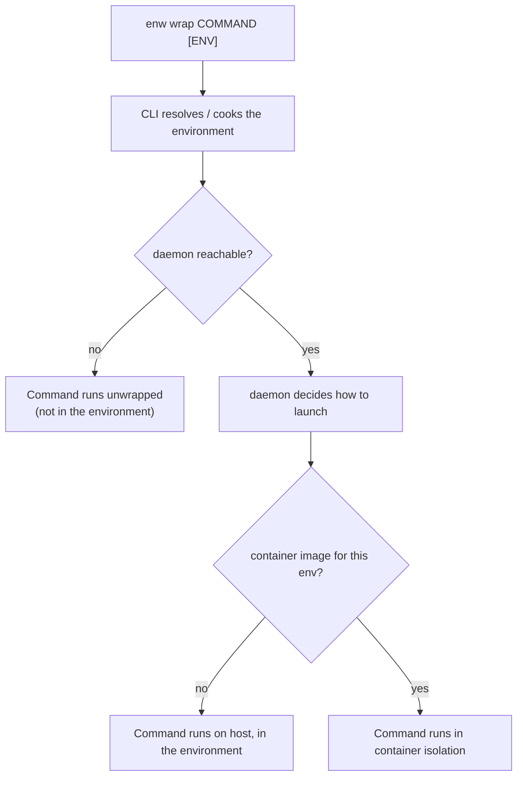

Everything enwiro launches in an environment goes through one command:
**`enw wrap`**. It is the single chokepoint where an environment's working
directory, its `ENWIRO_ENV` variable, and (optionally) container isolation are
applied before your program starts.

```sh
enw wrap <COMMAND> [ENVIRONMENT] [-- [COMMAND_ARGS]...]
```

`enw wrap bash my-project` runs `bash` inside the `my-project` environment. If
you omit the environment name, enwiro resolves the
[active environment](/activating-workspaces/) (and sets it up on demand if it
doesn't exist yet).

## How a launch is resolved

`enw wrap` does two things, in two different places:

1. **The CLI resolves (and, on demand, cooks) the environment.** This turns the
   environment name into a concrete project path. It stays in the `enw` process
   because cooking is interactive and local.
2. **The daemon decides _how_ to launch.** The CLI hands the resolved
   `(name, path, command, args)` to the daemon over its RPC socket
   (`launch.resolve`). The daemon is the single source of truth for the launch
   decision: it answers with the final program, arguments, and environment
   variables. The CLI then `exec`-replaces itself with that result, so your
   terminal (the tty) stays attached to the launched process.



The container branch runs your command inside a per-environment image; see
[the container isolation path](#the-container-isolation-path-experimental) for
the exact invocation.

When the daemon answers (host or container), the program runs with its working
directory set to the environment's path and `ENWIRO_ENV` set to the environment
name, so tools and shells can detect which environment they are in. The
daemon-down fallback is the exception: it runs bare.

## The host path (default)

Out of the box, the daemon returns the command unchanged: it runs on the host,
in the environment's directory, with `ENWIRO_ENV` set. This is the behaviour you
get without any isolation build flag.

## The container isolation path (experimental)

:::caution[Highly experimental]
Container isolation is an early, experimental feature and is subject to rapid
change. Expect rough edges and breaking changes; do not rely on the exact
behaviour described below.
:::

enwiro can instead run your command inside a container, one image per
environment. This is **off by default** and gated two ways:

- The daemon must be built with the `container-wrap` feature (see below).
- A local OCI image named `enwiro/<environment-name>` must exist. Its presence
  is the trigger; building it is out of band (you bring your own image). If no
  such image exists, the launch falls back to the host path.

When both hold, the daemon returns a container invocation roughly equivalent to:

```sh
<engine> run --rm -it \
  --mount type=bind,source=<env-path>,target=<env-path> -w <env-path> \
  -e ENWIRO_ENV=<env-name> \
  enwiro/<env-name> <command> [args...]
```

- **Engine** is auto-detected: `podman` is preferred, then `docker`.
- The project directory is bind-mounted at the same path it has on the host (and
  used as the working directory), so paths match and file watching/HMR work on a
  Linux host. A `--mount` is used rather than `-v src:dst` so a path containing a
  colon is not mis-parsed.
- `-it` is used when the caller's stdin is a terminal, `-i` otherwise.

> The image tag is `enwiro/<name>`, so the environment name must be a valid OCI
> tag. Names containing characters like `#` or `/` are not yet sanitised; use a
> simple-named environment when trying this out.

### Running with the isolation build flag

The container path lives behind the `container-wrap` Cargo feature on the
`enwiro-daemon` crate, so it is only available from a source build. Follow the
[development setup](/development-setup/) first; its `just install-dev` recipe
already builds the feature in (it passes
`--features enwiro-daemon/container-wrap`) and restarts the daemon. Because the
path is still image-gated, nothing changes until you create a trigger image.

To build just the daemon by hand instead:
`cargo build --release -p enwiro-daemon --features container-wrap`.

### Try it end to end

```sh
# 1. Build + install with the feature (restarts the daemon)
just install-dev

# 2. Create a trigger image for a simple-named environment, e.g. "my-project"
echo 'FROM debian:stable-slim' | docker build -t enwiro/my-project -

# 3. Launch into it: you land in the container, at the bind-mounted project dir
enw wrap bash my-project

# An environment with no matching image still runs on the host:
enw wrap bash some-other-env
```

To turn the container path off again for an environment, remove its image
(`docker rmi enwiro/my-project`).

## Notes and limits

- **The daemon must be running.** It is the source of truth for how a command is
  launched. If it is down, `enw wrap` does not half-wrap: it prints an error to
  stderr, shows a desktop notification, and execs the command bare, with no
  environment directory, no `ENWIRO_ENV`, and no isolation.
- **Terminal emulators are wrapped specially.** A recognised terminal (currently
  kitty only) runs on the host with the environment's shell wrapped inside it, so
  the terminal needs no display passthrough. This is an experimental pilot.
- **Claude Code gets a scoped OAuth token (temporary, trusted use only).** If you
  configure a token (the daemon's `CLAUDE_CODE_OAUTH_TOKEN`, else a single line in
  `~/.config/enwiro/claude_oauth_token`), a **`claude`** launch in a container
  receives it as `CLAUDE_CODE_OAUTH_TOKEN`, so it authenticates with your
  subscription without mounting `~/.claude`. Mint the token with `claude
  setup-token`. The token is injected **only for `claude` commands** (other
  commands never receive it), but note a container env var is readable by every
  process in that container, so it is only appropriate for **trusted**
  environments. The intended end state is per-process delivery (Claude's
  `apiKeyHelper`) gated by environment trust.
- **First-run onboarding is skipped automatically.** Claude Code has no env var
  or setting to skip its first-run wizard (theme picker and "trust this folder"
  prompt); the only lever is a `.claude.json` marking `hasCompletedOnboarding`
  and the workspace's `hasTrustDialogAccepted`. Rather than make you bake that
  into every image, the container launch **seeds a default `.claude.json` at
  start if one is absent** (keyed to the environment's directory; it never
  overwrites one the image already ships), so `claude` in a fresh container goes
  straight to the prompt.
- **`enw wrap` is the only launch path that consults the daemon today.** Other
  ways enwiro starts programs (`enw run` via an adapter, `enw :<gear>` cli
  entries, and the daemon's cook-autorun) still launch on the host and do not yet
  go through `launch.resolve`.
