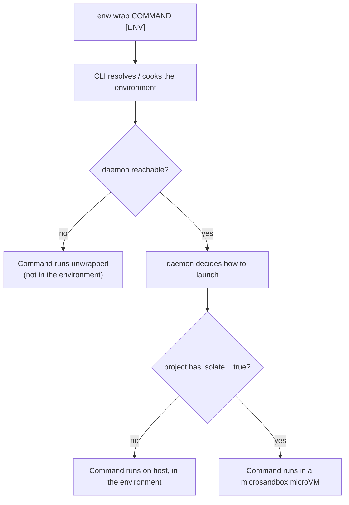

Everything enwiro launches in an environment goes through one command:
**`enw wrap`**. It is the single chokepoint where an environment's working
directory, its `ENWIRO_ENV` variable, and (optionally) microVM isolation are
applied before your program starts.

```sh
enw wrap <COMMAND> [ENVIRONMENT] [-- [COMMAND_ARGS]...]
```

`enw wrap bash my-project` runs `bash` inside the `my-project` environment. If
you omit the environment name, enwiro resolves the
[active environment](/activating-workspaces/) (and sets it up on demand if it
doesn't exist yet).

## How a launch is resolved

`enw wrap` does two things, in two different places:

1. **The CLI resolves (and, on demand, cooks) the environment.** This turns the
   environment name into a concrete project path. It stays in the `enw` process
   because cooking is interactive and local.
2. **The daemon decides _how_ to launch.** The CLI hands the resolved
   `(name, path, command, args)` to the daemon over its RPC socket
   (`launch.resolve`). The daemon is the single source of truth for the launch
   decision: it answers with the final program, arguments, and environment
   variables. The CLI then `exec`-replaces itself with that result, so your
   terminal (the tty) stays attached to the launched process.


```mermaid
flowchart TD
    A["enw wrap COMMAND [ENV]"] --> B["CLI resolves / cooks the environment"]
    B --> C{"daemon reachable?"}
    C -- "no" --> H["Command runs unwrapped<br/>(not in the environment)"]
    C -- "yes" --> D["daemon decides how to launch"]
    D --> E{"project has isolate = true?"}
    E -- "no" --> F["Command runs on host, in the environment"]
    E -- "yes" --> G["Command runs in a microsandbox microVM"]
    click G "#the-isolation-path-experimental" "How isolation runs your command"
```

The isolated branch runs your command inside a microsandbox microVM; see
[the isolation path](#the-isolation-path-experimental) for the exact
invocation.

When the daemon answers (host or container), the program runs with its working
directory set to the environment's path and `ENWIRO_ENV` set to the environment
name, so tools and shells can detect which environment they are in. The
daemon-down fallback is the exception: it runs bare.

## Using enwiro as your terminal's shell

`enw shell` is `enw wrap` for your shell, built to be set as the terminal
emulator's configured shell (e.g. kitty's `shell enw shell`). Every new
terminal window then opens inside the active environment automatically:

```sh
enw shell [--timeout <SECONDS>] [SHELL_ARGS...]
```

It resolves the shell from `$SHELL` (ignoring it if it points back at
enwiro itself), falling back to your login shell from passwd, then
`/bin/sh`, and forwards any arguments verbatim - so `enw shell -c 'ls'`
works wherever `$SHELL -c` is expected.

Where it differs from `wrap`: activation owns cooking, `enw shell` never
cooks (see ADR-0005). If the active workspace's environment has a matching
recipe but does not exist yet - typically because `enw activate` is still
cooking it in another process - `enw shell` shows a spinner on stderr and
waits for the environment to appear, up to `--timeout` seconds (default 30,
0 waits forever). On timeout it prints one warning line and starts a plain
shell; the environment is picked up by new terminals once it is ready.

In every degraded case - no environment, no matching recipe, no adapter, or
the daemon unreachable - it silently starts your plain, unwrapped shell, so
a terminal always opens.

## The host path (default)

Out of the box, the daemon returns the command unchanged: it runs on the host,
in the environment's directory, with `ENWIRO_ENV` set. This is the behaviour you
get without any isolation build flag.

## The isolation path (experimental)

:::caution[Highly experimental]
Isolation is an early, experimental feature and is subject to rapid change.
Expect rough edges and breaking changes; do not rely on the exact behaviour
described below.
:::

enwiro can instead run your command inside a [microsandbox](https://github.com/superradcompany/microsandbox)
microVM (ADR-0006). This is **off by default** and gated two ways:

- The daemon must be built with the `container-wrap` feature (see below).
- The project's `.enwiro.toml` must declare `isolate = true` under
  `[isolation]`, with an image/snapshot name to boot -- either there, or as a
  personal default under `[isolation]` in `~/.config/enwiro/isolation.toml`.
  enwiro never builds this image itself (you bring your own); there is no
  enwiro-shipped default at either level.

```toml
# .enwiro.toml, at the project root
[isolation]
isolate = true
image = "my-snapshot"
```

If `isolate = true` but no image resolves anywhere, or the `msb` CLI isn't
installed, `launch.resolve` errors and `enw wrap` falls back to its one
existing degrade path: a loud warning, then a bare host launch (same as a
down daemon -- see [Notes and limits](#notes-and-limits)).

When isolation is configured, the daemon returns an invocation roughly
equivalent to:

```sh
msb run -m 4G -t \
  -v <env-real-path>:<env-real-path> -w <env-real-path> \
  -e ENWIRO_ENV=<env-name> \
  -u <your-uid>:<your-gid> \
  <image> -- <command> [args...]
```

- **Backend**: microsandbox only, driven as a subprocess to its `msb` CLI --
  no other engine, no runtime choice. Each launch is a real libkrun microVM
  (its own guest kernel), not a shared-kernel container.
- **Guest memory is fixed at 4G for every launch.** `msb`'s own default
  (~517M, verified hands-on) OOM-kills real dev tools with no explanation
  beyond a bare `Killed`. Unlike the old krun runtime, microsandbox does not
  appear to return freed guest memory to the host as it's freed (verified: a
  sandbox that allocated then freed 2G held that RSS on the host afterward),
  so this is a fixed ceiling rather than a fraction of the host's RAM.
- The project directory is bind-mounted at its **real, symlink-resolved**
  path (and used as the working directory) -- not enwiro's own stable
  per-environment symlink address, if the environment has one. Unlike
  podman, `msb` refuses to mount a symlinked source at all ("Too many levels
  of symbolic links"), so the daemon resolves it first; this also happens to
  be the exact path a git worktree's own internal bookkeeping
  (`.git/worktrees/<name>/gitdir`) already expects, so one mount serves both.
- Ownership needs no special handling: microsandbox's mounts already present
  a host-owned directory as owned by the guest's own uid in either direction
  (verified hands-on: a file the guest creates comes back on the host owned
  by the real host user, and `git commit` in a bind-mounted repo works with
  no ownership flags at all).
- `-u <your-uid>:<your-gid>` is set anyway (Linux only), purely so the
  process itself doesn't run as root -- hardening, and required by some
  tools that refuse to run as root at all (e.g. Claude Code's
  `--dangerously-skip-permissions`). It has no effect on file ownership,
  which already works regardless of which uid the guest runs as.
- `-t` is used when the caller's stdin is a terminal, `--no-tty` otherwise.
- Cookbooks can also declare that an environment depends on additional host
  paths beyond its own project directory - e.g. a git worktree's main repo,
  which holds the shared object database the worktree's `.git` points into.
  Each declared path is mounted at its own identical host location.

> For git worktrees specifically: mounting a worktree's main repo mounts its
> whole `.git`, including the object database every branch's commits live in.
> So this isn't scoped to just this worktree - any committed content on any
> branch of the repo is already reachable from inside the sandbox (`git
> show`/`checkout` any commit), and `git worktree list` just makes the other
> worktrees' names and commit hashes easy to find (others show `prunable`,
> since their checkout paths aren't mounted, but their commits are). Only
> *uncommitted* changes sitting in another worktree's own working directory
> stay inaccessible.

> **Known limitation:** `msb`'s mount flags (`-v` and friends) have no
> colon-safe syntax the way podman's `--mount type=bind,...` did -- a host
> path containing `:`, `,`, or `;` is refused by `msb` itself at launch time,
> rather than mis-mounted silently. Rare in practice for enwiro project paths.

> **Egress is open by default.** enwiro doesn't configure any network policy
> today (no `--net-rule`/`--no-net`); microsandbox's own default already
> allows outbound to the public internet while denying inbound to
> private/internal targets. A hardened, project-configurable egress policy is
> future work, not part of this feature yet.

### Running with the isolation build flag

The isolation path lives behind the `container-wrap` Cargo feature on the
`enwiro-daemon` crate, so it is only available from a source build. Follow the
[development setup](/development-setup/) first; its `just install-dev` recipe
already builds the feature in (it passes
`--features enwiro-daemon/container-wrap`) and restarts the daemon. Nothing
changes for a project until it sets `isolate = true` and an image resolves.

To build just the daemon by hand instead:
`cargo build --release -p enwiro-daemon --features container-wrap`.

Also install [microsandbox](https://github.com/superradcompany/microsandbox)
itself (the `msb` CLI) -- it isn't an enwiro dependency, it's a separate tool
enwiro shells out to, so it needs its own install per the project's own
instructions.

### Try it end to end

```sh
# 1. Build + install with the feature (restarts the daemon)
just install-dev

# 2. Turn on isolation for a project, pointing at an image/snapshot you
#    already have (enwiro never builds one for you)
cat >> /path/to/my-project/.enwiro.toml <<'EOF'
[isolation]
isolate = true
image = "my-snapshot"
EOF

# 3. Launch into it: you land in the microVM, at the bind-mounted project dir
enw wrap bash my-project

# A project with no [isolation] section still runs on the host:
enw wrap bash some-other-env
```

To turn isolation off again, remove or set `isolate = false` in the
project's `.enwiro.toml`.

### Credentials and tool-specific setup

Isolation is deliberately tool-agnostic: enwiro does nothing specific for any
particular agent, CLI, or credential. Whatever a tool needs (an API key, a
config file, a first-run setup step) is on the image or the tool's own
config, same as any other BYO dependency -- there is no enwiro-side
credential-passthrough mechanism today. If you're running an agent like
Claude Code or another coding tool inside the sandbox, configure its auth the
way you would in any other fresh environment (baked into the image, or set
up interactively on first launch).

## Notes and limits

- **The daemon must be running.** It is the source of truth for how a command is
  launched. If it is down, `enw wrap` does not half-wrap: it prints an error to
  stderr, shows a desktop notification, and execs the command bare, with no
  environment directory, no `ENWIRO_ENV`, and no isolation. A project with
  `isolate = true` but no resolvable image degrades the same way -- there is
  no separate "refuse to launch" failure mode.
- **Terminal emulators are wrapped specially.** A recognised terminal (currently
  kitty only) runs on the host with the environment's shell wrapped inside it, so
  the terminal needs no display passthrough. This is an experimental pilot.
- **`enw wrap` is the only launch path that consults the daemon today.** Other
  ways enwiro starts programs (`enw run` via an adapter, `enw :<gear>` cli
  entries, and the daemon's cook-autorun) still launch on the host and do not yet
  go through `launch.resolve`.
